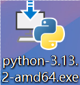
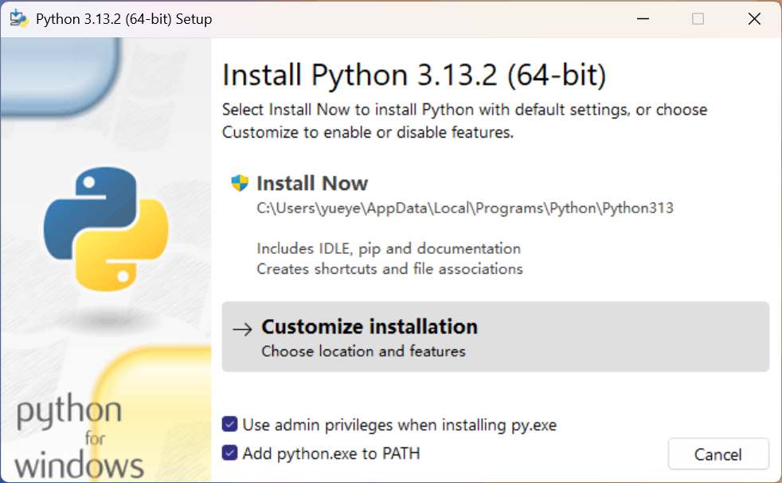
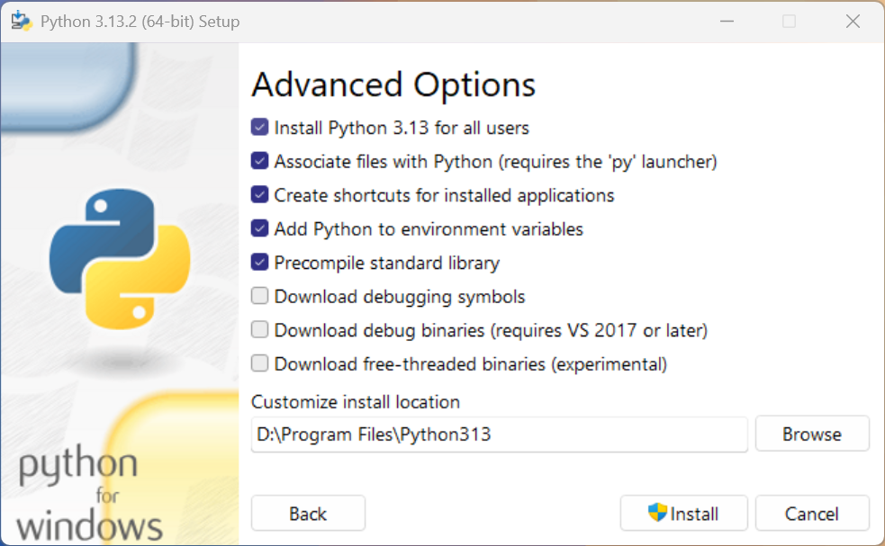
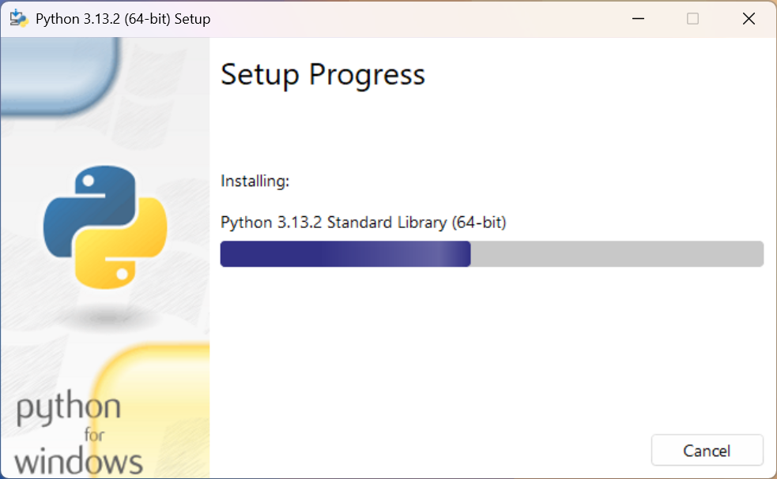

# Bing Wallpaper

## Description
A collection of high-quality wallpapers from Bing's daily images.
Just run `main.py`. This script will automatically download image and set it as your wallpaper. 

## Features
- Daily updated wallpapers from Bing
- High-resolution images
- Easy to download and use

## Installation
1. Install `Python`.
   1. Go to http://python.org/downloads/.
   
   2. Click `Download` button, download `Python installer`.
   
   
   3. Open the file you just downloaded.
   
      
   4. Select 'Add python.exe to PATH' and click 'Customize Install'
   
   5. Click 'Next' button, come to the following interface, according to the picture configuration, the path can be customized, and then click 'Install'
   
   6. Wait for the installation, and when the installation is complete, click the button to end the installation.
   
   7. 